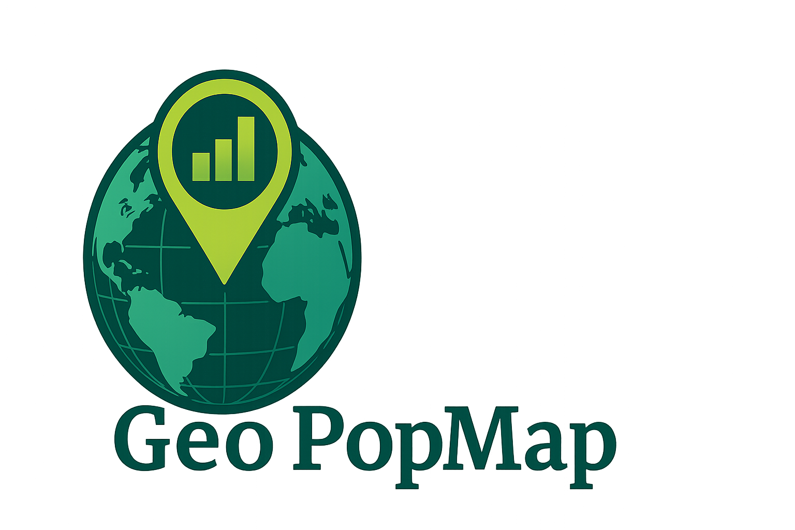
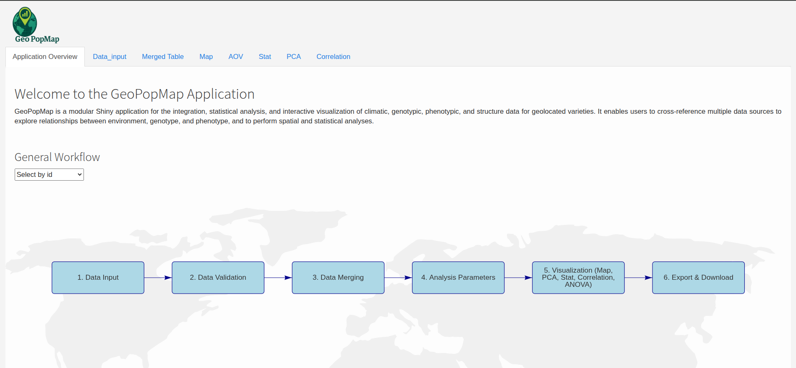
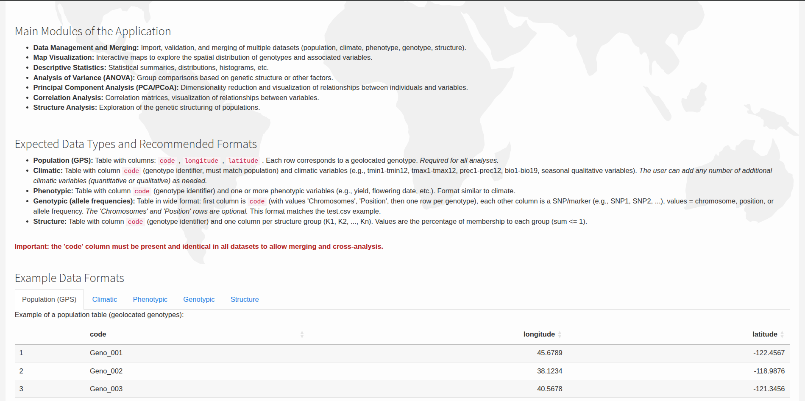

.. GeoPopMap documentation master file, created by
   sphinx-quickstart on Wed Jul 10 16:15:35 2024.
   You can adapt this file completely to your liking, but it should at least
   contain the root `toctree` directive.

=================================================
Welcome to the GeoPopMap Tutorial
=================================================

Project Contributors
--------------------

**Developer & Tutorial Author**

- Mohamad Yassine (mohamad.a.ysn@gmail.com)

**Collaborators**

- Sarah Ben Sadoun (sarah.ben-sadoun@inrae.fr)
- Yannick Olivier (yannick.olivier@inrae.fr)
- Stephane Nicolas (stephane.nicolas@inrae.fr)
- Franck Gauthier (franck.gauthier@inrae.fr)
- Agustin-Oscar Galaretto (agustin-oscar.galaretto@inrae.fr)
- Valentin Bourdin (valentin.bourdin1@etu.u-paris.fr)

This tutorial will guide you through the process of using GeoPopMap, a comprehensive R Shiny application for analyzing and visualizing multi-dimensional agricultural data.

   The main interface of the GeoPopMap application.

Getting Started
---------------

This tutorial is divided into several sections, each covering a specific aspect of the application. We recommend following them in order to get a complete understanding of the workflow.

.. toctree::
   :maxdepth: 2
   :caption: Tutorial Contents:

   prerequisites
   usage
   data_management_and_merging
   map_visualization
   pca
   correlation_analysis
   anova_analysis
   statistical_analysis

Introduction to GeoPopMap
-------------------------

GeoPopMap is a comprehensive R Shiny application designed for the analysis and visualization of multi-dimensional agricultural data. The application provides an integrated platform for handling and analyzing climatic, genotypic, and phenotypic data with a focus on spatial relationships and statistical analysis.

Key Features
------------

- **Data Upload and Validation**: Supports various data formats and validates data to ensure quality.
- **Data Merging**: Merge different datasets to create a comprehensive analysis-ready dataset.
- **Interactive Map Visualization**: Visualize geographic data and explore spatial patterns.
- **PCA and Correlation Analysis**: Perform statistical analyses to uncover relationships in your data.
- **ANOVA and Statistical Summaries**: Conduct analysis of variance and generate statistical summaries.

About This Tutorial
-------------------

This tutorial is designed to be interactive. At each step, we will show you what to do and what to expect. We will use placeholders for screenshots that you can replace with your own as you follow along.

Let's begin by setting up the required prerequisites.
